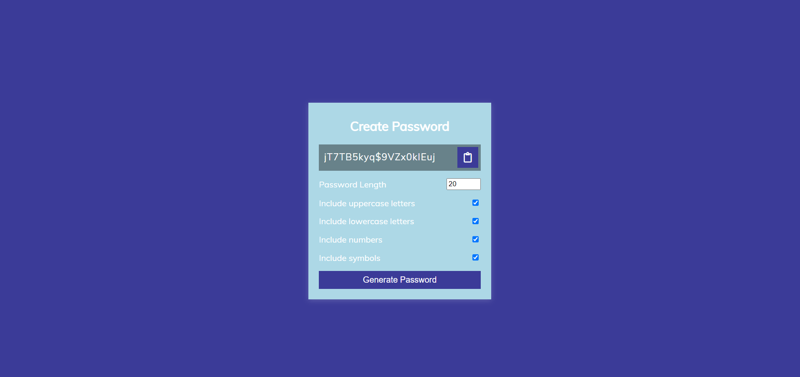

# JavaScript Project - Password Generator

## **Project: Password Generator**

### Concepts learned from this project:
- Learned About Generating random password based on the checkboxes selected.
- Learned about how Navigator is used to copy the password to the clipboard.
- Little complex one. Enjoyed while doing this.

**Live Link :** [Deployed Link](https://js-project-passwordgenerator.netlify.app/)
>### Preview :

